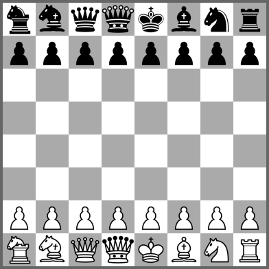
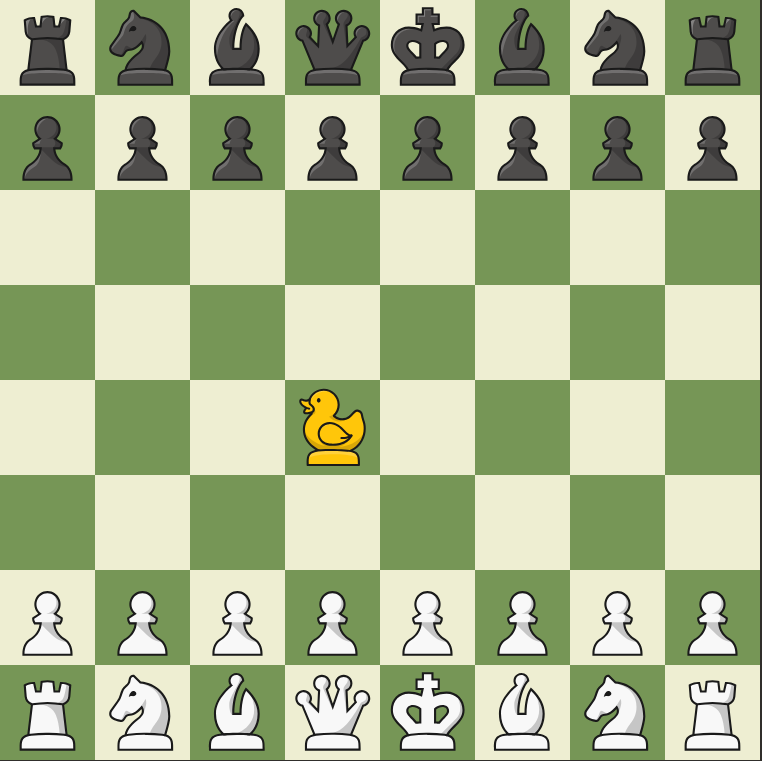


The baking boys have been known to dabble in a wee bit of chess.  
Specifically, on some [streams](../people/razvii.md#streams), [Jeremy](../people/jeremy.md) and [razvii](../people/razvii.md) will occasionally play chess against one another, this often upsets and demoralizes Jeremy.  
As such, to even the odds on the battlefield, the idea of playing [variations](#variants) has been introduced, where the rules of chess are turned upside down, inside out, and ocasionally... [diagonal](#diagonal-chess)...

# Variants
The following is a non comprehensive list of chess rules variations, as well as links to their respective websites.  
The list is in the rough order of how liked the variants are:

    
Fairy chess <a href="https://greenchess.net/variants.php?cat=3" target="_blank" title="Opens in a new tab">[link]</a>

    
    <blockquote blame="Greenchess.net">These chess variants involve new chess pieces, which do not exist in standard chess, but are similar to those.</blockquote>
    

        Fairy chess is a category of chess on <a href="https://greenchess.net" class="external-link">greenchess.net</a> where certain pieces are replaced by alternative versions with different, often really weird move sets. 
        A good example is whatever the hell this is:
    

    

    
Duck Chess <a href="https://www.chess.com/variants/duck-chess" target="_blank" title="Opens in a new tab">[link]</a>

    
    <blockquote blame="Jeremy">I fucking hate the duck!</blockquote>
    <blockquote blame="Chat">duck chess duck chess duck chess duck chess duck chess duck chess duck chess duck chess  
    duck chess duck chess duck chess duck chess duck chess duck chess duck chess duck chess  
    duck chess duck chess duck chess duck chess duck chess duck chess duck chess duck chess  
    </blockquote>
    

        Duck chess is a variant of chess on <a href="https://chess.com" class="external-link">chess.com</a> where a completely inert duck piece exists on the board.  
        On each turn, after the player has made their regular move, they will then need to move the duck piece on any empty space on the board. 
        The duck piece serves to block the opponent from making certain moves, it cannot take pieces, it cannot be taken, it can only quack.  
    

    

        Fear its quacking might.
    

    

    
Spell chess <a href="https://www.chess.com/variants/spell-chess" target="_blank" title="Opens in a new tab">[link]</a>

    
    

        Spell chess is a variant of chess on <a href="https://chess.com" class="external-link">chess.com</a> where each player can use a spell before their turn.
    

    

        By default each player gets 5 jump spells and 5 freeze spells. 
        The spells recharge after 3 turns and you cannot use the same spell back to back.
    

    

        The freeze spell can be used to freeze all spaces in a 3x3 square, while the jump spell can be cast on a piece in order to move as if that piece wasn't there, "jumping" over it.
    

> To be continued