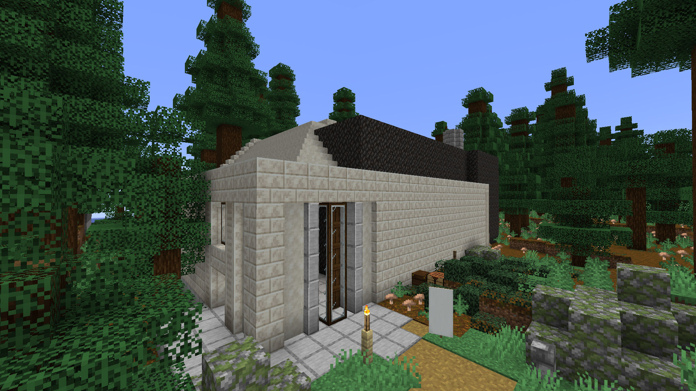



Big Chicken is an ethical producer of fast(ish) food.

# Location
{: width="900" title="The location of the smeltery on the map. Open in new tab to zoom in!"}

# Menu

## The Big
A heavy hitter for big mouths - juicy fried chicken with a crispy glaze carefully placed atop a refreshing bed of carrot and cabbage, served to go in a delicious hearty sub.

## The Other One
juicy fried chicken with a crispy glaze carefully placed atop a refreshing bed of carrot and cabbage, served to go in a delicious hearty sub.

## The Cassic
The classic chicken sandwhich, a fan favourite - juicy fried chicken with a crispy glaze carefully placed atop a refreshing bed of carrot and cabbage, served to go in a delicious hearty sub.

# Engine Room
Few are given the privalege of peeking behind the kiosk of Big Chicken, but those who have describe a vast cavernous space housing three mighty steam turbines; their enourmous power harnessed by a maze of belts, crushers, and furnaces suspended from the ceiling above.

# Chicken Tube™
At the heart of Big Chicken is the (in)famous Chicken Tube™ - a revolutionary device that supplies ethically bred chickens, all of which enjoy a high quality (sandwhich)fulfilling life with free range Z axis movement. Chickn Tube™ chickens are fed on a balanced diet of fresh seeds every day. The Chicken Tube™ is an all-in-one zero waste system, 100% of every chicken that goes in comes out, anything which cannot become a sandwhich is recycled to ensure maximum sustainability!

# Rumours
Despite its clear ethical promise, Big Chicken skeptics have claimed that conditions within the Chicken Tube™ are inhumane and warrant further investigation. PErmission has yet to be granted for any external inpection of Big Chicken's engine room, skeptics skeptics beleive this proves only that Big Chicken prioritises the protection of its corporate secrets and reinforces their concerns; Big Chickens CEO has been quick to point out that if the authorities had legitimate cause for concern then there is little Big Chicken could do to prevent investigation.

It has been suggested by some that Big Chicken's kitchens harness only a fraction of the power produced by its engine room. Big Chicken skeptics claim the franchise is a front for other services, alleging involvement with the unregulated manufacture of illegal substances.
