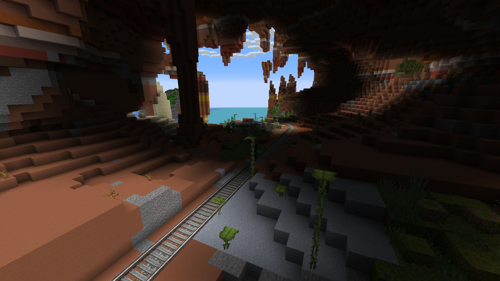



It goes south, then west (, and then north).

# Location
{: width="900" title="The location of the eastern station in the compound"}

# Stations

Great Southwestern Railway has 2 general stations (1 at each end), and a maintenance station along the middle.

The eastern station is part of the main compound.

The western station is part of the mesa biome.

{: width="900" title="Western station interior"}

The maintenance station in the middle lies in a snowy biome and houses The Implement.

# Construction

Great Southwestern Railway has been constructed using The Implement.

After a great expedition by Jeremy, the path had been laid out to the mesa biome. As marked by wooden posts, The Implement laid down tracks quasi-followiwng the marked route, up until the end station. This was not in an optimal straight line. In fact, unnecessary lateral movement was executed, costing more than double the minimum amount of track needed.

Only 1 line has been constructed.

# Trains

Great Southwestern Railway supports all types of trains; passenger trains, freight trains, support trains... as long as they fit standard track gauge. As of now, there's no scheduling to regulate concurrent use of the rails, so communicate and be polite.

Current trains utilizing the railway:
- The Iron Curtain
- Unnamed irrelevant other train
