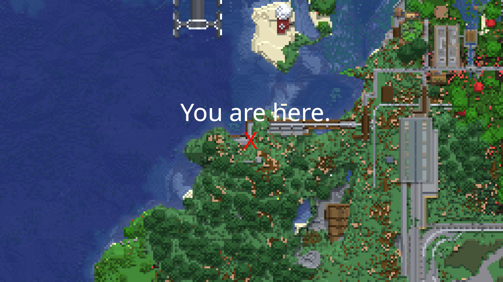
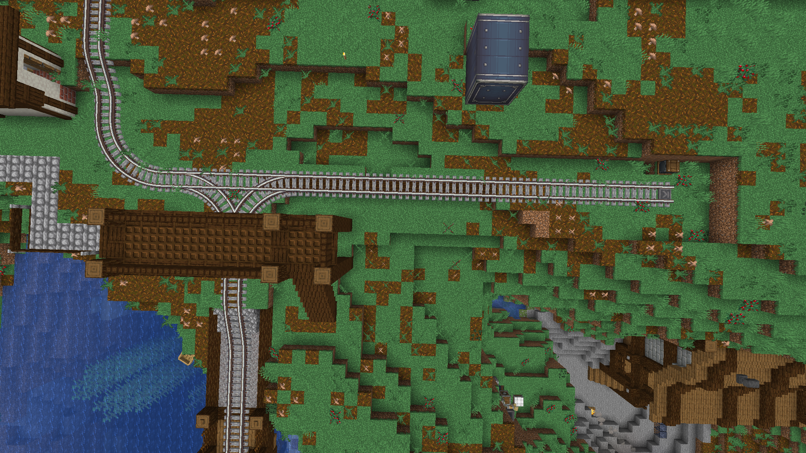
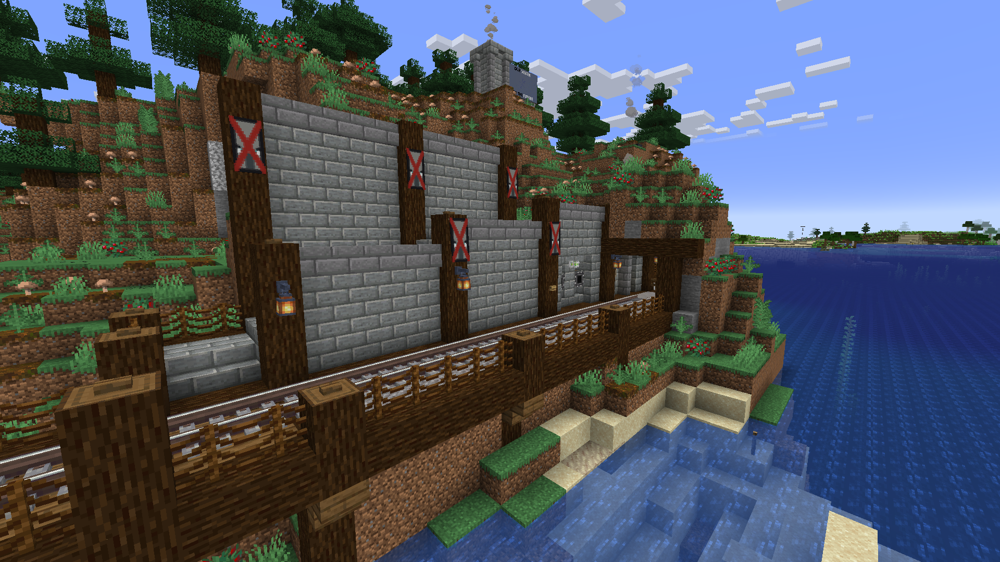



---
> "Raz the smeltery's not working."
{: blame="Jeremy"}
> "It's in full auto, Jeremy."
{: blame="Razvii"}

Built by [Razvii](../people/razvii.md) to facilitate the mass-production of baked goods, the smeltery is one of the oldest, and most reliable, peices of infrastructure on the [Minecraft](../games/minecraft.md) server.

# Location

{: width="900" title="The location of the smeltery on the map. Open in new tab to zoom in!"}

# Operation

The smeltery has three modes, selected from a control valve in the foyer.

## **Manual**

In manual mode, unprocessed goods are injected into the smeltery from a user-accessible barrel placed immediately adjacent to [route 1](route1.md). For reasons related directly and *only* to security, it is strictly forbidden for OSHA to be given access to this barrel. Manual mode is indicated with an amber light.

Processed products are deposited into a second barrel adjacent to the input.

## **Automatic**

In automatic mode, the input and output of goods and products is handled directly by route 1. Automatic mode is indicated with a green light. If a train is ever detected on the rail siding of the smeltery, this mode is automatically engaged in order to avoid stalling the entire logistics network.

## **Disabled**

When the smeltery is disabled, it does not process goods. This mode is indicated with a red light.  

---

It is worth noting that, due to the nature of the 3 operating modes, a constant, never ending situation has appeared where someone drops off their product in the manual input, and is then confused when those items are not being processed.  
This, however, has been noted as "won't fix" by staff, on grounds of "not fixing issues spurred on by incompetence.".

# Train access

The smeltery acts as the terminus for route 1. Like much of route 1, the smeltery terminus is compromised by its geography. Being attatched to the side of coastal hill, the smeltry terminus lacks space for a turning loop; trains entering and leaving the smeltery must use a reversing siding to re-orient themselves after departing. The capacity of said siding sets a hard-limit on the maximum length of trains using route 1.  
{: width="900" title="The reversing siding used to re-orient trains before returning along route 1. Open in new tab to zoom in!"}
{:width="900" title="The smeltery terminus station. Open in new tab to zoom in!"}

