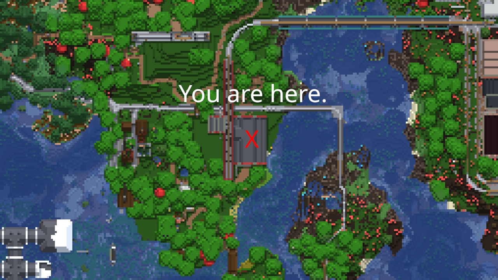
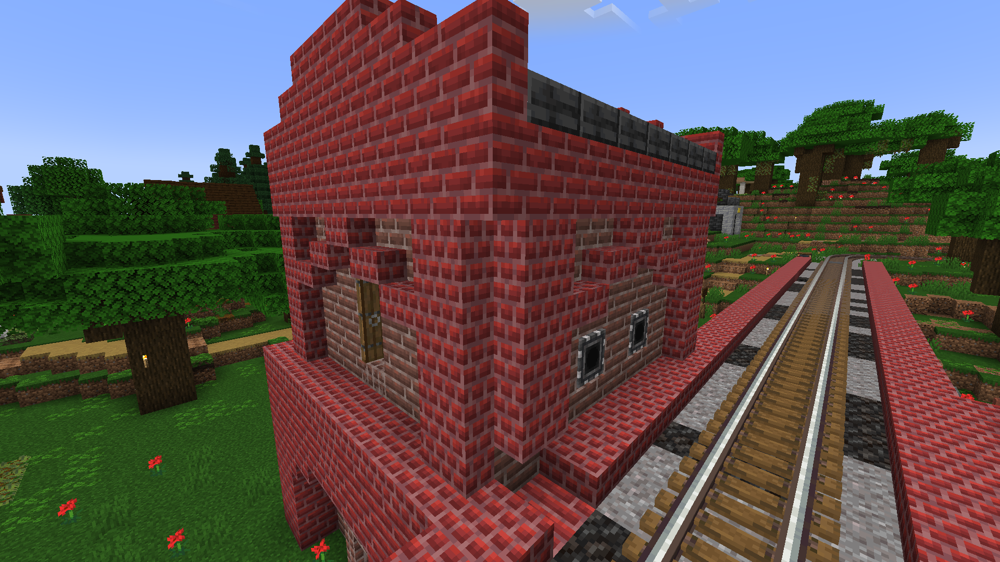
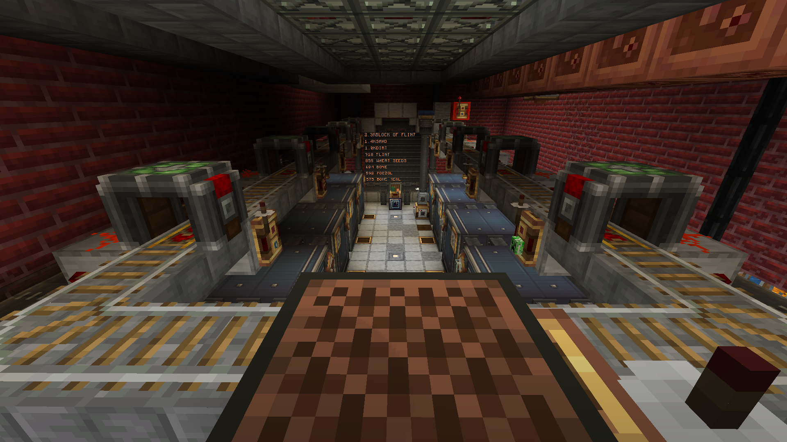
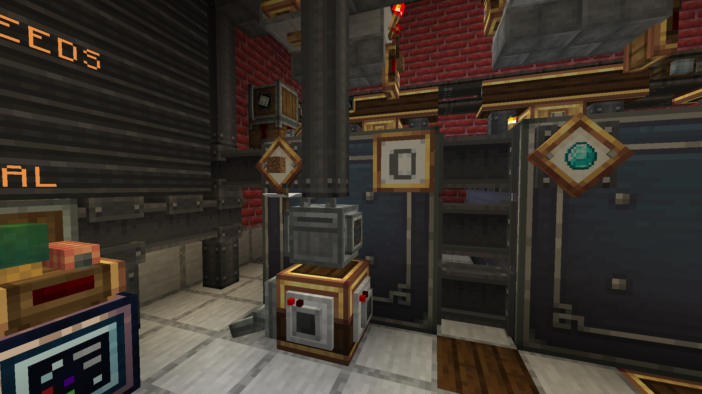
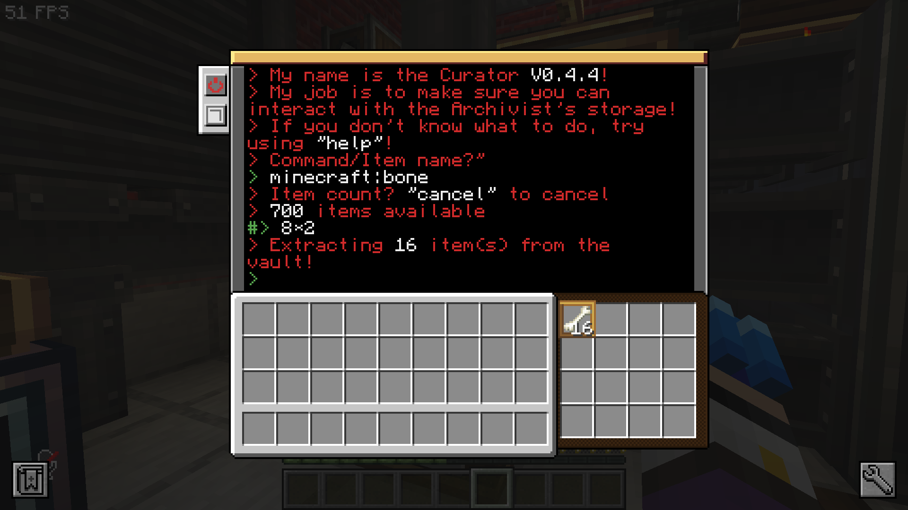



> "AAAAAAAAAAAAAAAAAAAAAAAAAAAAAAAAAAAAAAAAAAHHHHHHHHHHHHHHHHHHHHHHHHHHHHHHHHHHHHHHHHH"
{: blame="Poor, unfortunate fool hit by Curator's gantry"}

The warehouse is the primary item depot for both players and vehicles, constructed as one of the first structures in the oxbow peninsula that acts as the central area of the compound.

# Location

{: width="900" title="The location of the warehouse on the map. Open in new tab to zoom in!"}

# Functions
The warehouse is not just a big bulk storage location, it hosts several advanced machines and systems with the intended purpose of making item distribution and storage easier.

## **Bulk storage and sorting**

The warehouse hosts 8 massive vaults, in banks of 4 on either side, with additional temporary storage underground.

The vaults host the following category of items, in order of the sorting system:
- Bulk food
- Wood
- Fish
- Bricks
- Mechanical Components
- Glass
- Stone
- Minerals
- Miscellaneous  

These items are sorted by running a conveyor belt above each vault in the order described, as such, if one item fits multiple categories, it will be delivered in the first match.

---
## **Train access**

The warehouse is, with some difficulty, able to interact with, and distribute items directly to [route 1](route1.md) through a (yet to be fully implemented) computerized train port at the top.
{: width="900" title="The train port of the warehouse, in its own separate building. Open in new tab to zoom in!"}

---
## **Curator and its gantry**

Curator, also known as **CC-Curator** is an advanced wireless noisy turtle from the mod [CC:Tweaked](https://tweaked.cc/) that acts as the current primary way of interacting with each vault.  
Curator has been personally programmed by Razvii and features a command line interface, it was originally called **Archivist**, which was supposed to be the central system that interacts with every vault at once, however that proved to be rather difficult, and so, **Curator** has been devised, which interacts with one vault at a time.

Curator is attached to an overhead Gantry system that is activated from a control panel at the door, or with a remote control tablet; while the entire programming and software architecture, including UI and everything was programmed by **Razvii**, **Jeremy** has devised a clever gantry system that moved the robot around to each vault.  

 For more information, see (insert link to curator page.) 

If you would like to contribute or look at the code, you can head over to [the source code](https://github.com/razvii22/cc-curator) on Github!  
{: width="400" title="The Gantry rail system! Open in new tab to zoom in!"}
{: width="400" title="The curator himself! Riding on his lil gantry~ Open in new tab to zoom in!"}
{: width="400" title="The curator himself! Riding on his lil gantry~ Open in new tab to zoom in!"}